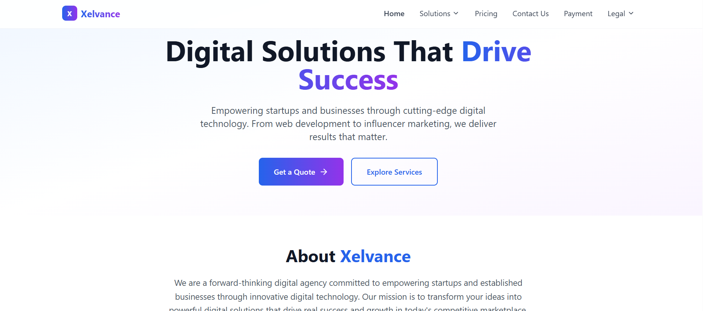
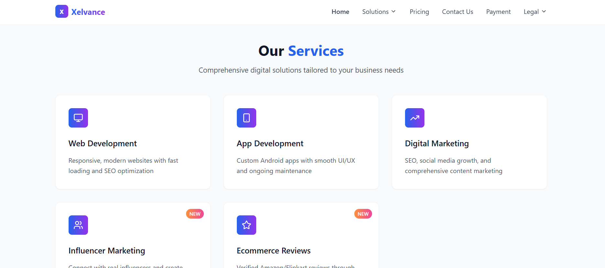
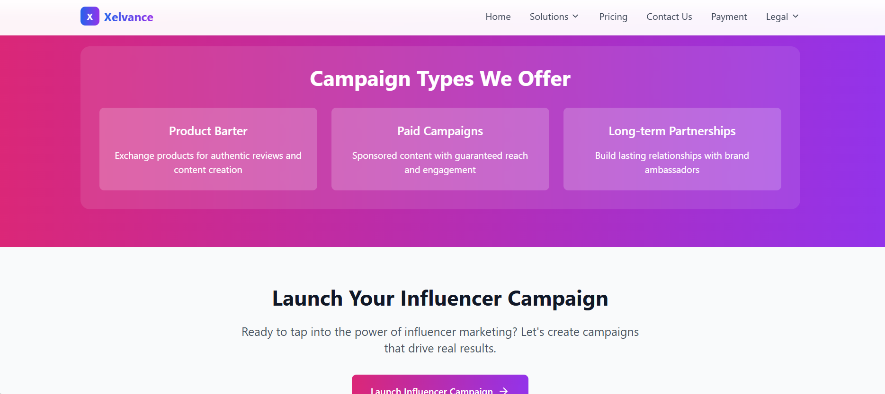
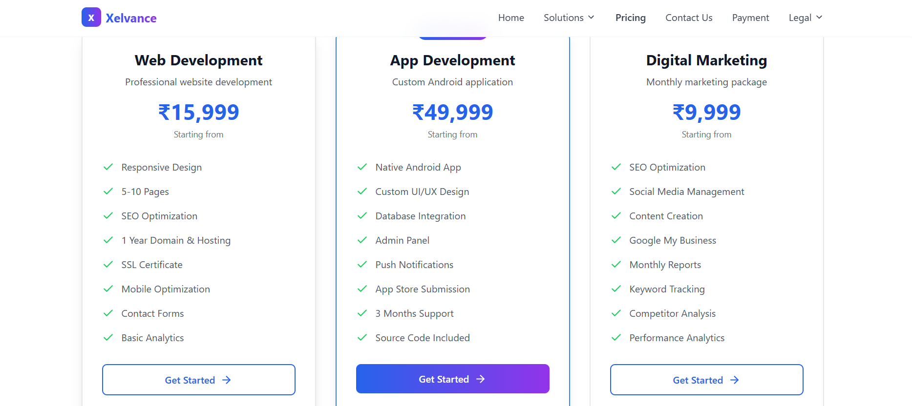

# 🚀 Digital Agency Website – Vite + React + shadcn/ui + Supabase



This is a modern, scalable web application designed for digital agency operations (like Xelvance) using a powerful tech stack: **Vite**, **React**, **TypeScript**, **shadcn/ui**, **Tailwind CSS**, and **Supabase**.

It includes service pages, custom forms, Supabase backend integration, and a secure payment submission flow with QR support.

---

## 📁 Tech Stack

- ⚡️ [Vite](https://vitejs.dev/) – Lightning-fast frontend tooling
- ⚛️ [React](https://reactjs.org/) – Component-based UI
- 🧑‍💻 [TypeScript](https://www.typescriptlang.org/) – Static type checking
- 🎨 [shadcn/ui](https://ui.shadcn.dev/) – Accessible UI components built on Radix UI
- 💨 [Tailwind CSS](https://tailwindcss.com/) – Utility-first CSS framework
- 🧪 [Supabase](https://supabase.com/) – Realtime backend, database, and auth
- 🛠️ ESLint + PostCSS – Development quality and styling tools

---

## 📂 Folder Structure

```bash
.
├── public/                # Static assets
├── src/                   # Main source code
│   ├── components/        # Reusable UI components
│   ├── pages/             # Route-level pages (Home, Contact, etc.)
│   ├── hooks/             # Custom React hooks (if any)
│   ├── lib/               # Utility libraries (e.g., Supabase client)
│   ├── styles/            # Global styles (Tailwind, etc.)
│   └── App.tsx            # Root component
├── supabase/              # SQL scripts, Supabase setup, schema
├── index.html             # Root HTML entry
├── package.json           # Project metadata and scripts
├── tailwind.config.ts     # Tailwind config
├── tsconfig.json          # TypeScript base config
└── README.md              # You are here!
```

## Current Features

🌐 Fully responsive layout with service-based architecture

📩 Contact & inquiry forms integrated with Supabase DB

📸 Secure payment form with:

Name, email, transaction ID

Payment screenshot upload

Project title and description

🔐 Backend data capture (SQL via Supabase)

📤 Error handling and email configuration

🌙 shadcn UI-based form validations

## Available Scripts

### Install dependencies

`npm install`

### Start local dev server

```
npm run dev

```

## Supabase Setup

You must connect your project to Supabase via environment variables.

Create the necessary tables via scripts in /supabase:

User Submissions

Payments

Leads or Inquiries

Make sure to set VITE_SUPABASE_URL and VITE_SUPABASE_ANON_KEY in your .env file.

## To Do / Upcoming

Add Admin dashboard (Next.js or separate route)

Enable form-based authentication (Supabase Auth)

Add real-time dashboard or email alerts

Integrate Razorpay or Stripe (optional)

## Screenshots




